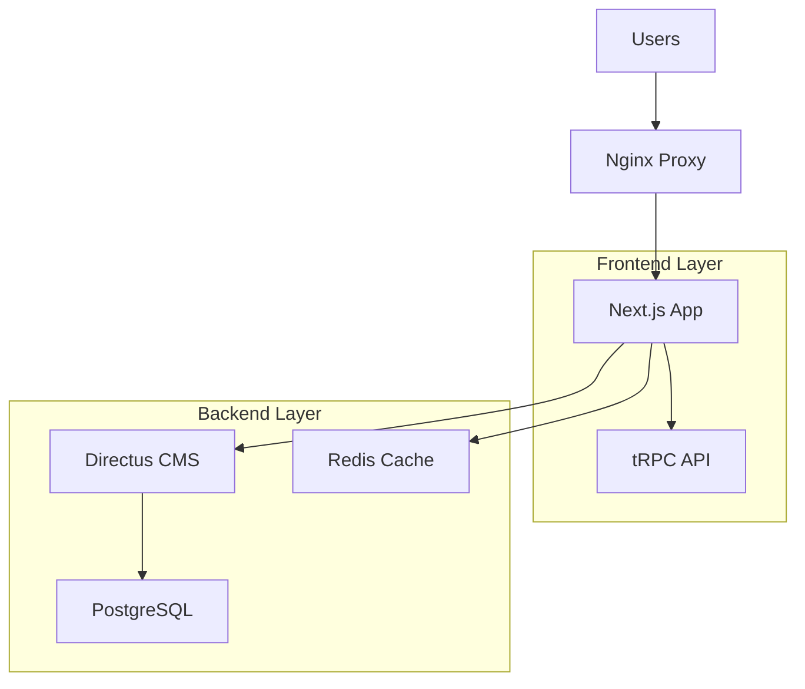

# 🎵 HarmonyX CMS v5

[](https://nextjs.org/)
[](https://www.typescriptlang.org/)
[](https://directus.io/)
[](https://www.docker.com/)
[](https://www.postgresql.org/)

> **A modern, scalable Content Management System built with cutting-edge technologies**

HarmonyX CMS v5 is a full-stack, headless CMS solution that combines the power of Next.js 15, Directus, and PostgreSQL to deliver exceptional performance, developer experience, and content management capabilities.

## 🌟 Key Highlights

- **🚀 Modern Stack**: Next.js 15 + TypeScript + Directus + PostgreSQL
- **🎨 Beautiful UI**: shadcn/ui components with dark/light themes
- **🌐 Multi-language**: Built-in internationalization (i18n)
- **🐳 Docker Ready**: Complete containerized development environment
- **⚡ High Performance**: Advanced caching, SSG, ISR, and image optimization
- **🔒 Enterprise Security**: Authentication, authorization, and data protection
- **📱 Mobile First**: Responsive design for all devices

## 📋 Table of Contents

- [Architecture Overview](#-architecture-overview)
- [Quick Start](#-quick-start)
- [Project Structure](#-project-structure)
- [Development](#-development)
- [Deployment](#-deployment)
- [Contributing](#-contributing)
- [License](#-license)

## 🏗️ Architecture Overview



### Core Components

| Component | Technology | Purpose |
|-----------|------------|---------|
| **Frontend** | Next.js 15 + TypeScript | Modern React framework with SSR/SSG |
| **CMS** | Directus 19 | Headless CMS for content management |
| **Database** | PostgreSQL 16 | Primary data storage |
| **Cache** | Redis 7 | High-performance caching layer |
| **Proxy** | Nginx | Load balancing and SSL termination |
| **API** | tRPC | Type-safe API communication |

## 🚀 Quick Start

### Prerequisites

Ensure you have the following installed:

- **Node.js** 18.17+ ([Download](https://nodejs.org/))
- **pnpm** 8+ ([Install](https://pnpm.io/installation))
- **Docker** & **Docker Compose** ([Install](https://docs.docker.com/get-docker/))
- **Git** ([Install](https://git-scm.com/downloads))

### Clone & Setup

```bash
# Clone the repository
git clone https://github.com/kanata-b/harmonyx-cms-v5.git
cd harmonyx-cms-v5

# Copy environment files
make env-all
```

### Start the Application

```bash
# Start all services (Database, CMS, Cache)
docker compose up -d

# Wait for services to be ready (about 30 seconds)
docker compose logs -f

# Install frontend dependencies
cd apps/cms
pnpm install

# Start development server
pnpm dev
```

### Access Your Application

| Service | URL | Description |
|---------|-----|-------------|
| **Frontend** | http://localhost:3000 | Main website |
| **Admin Panel** | http://localhost:3000/admin | CMS admin interface |
| **Directus CMS** | http://localhost:8055 | Headless CMS backend |
| **Database** | localhost:5432 | PostgreSQL (via client) |
| **Redis** | localhost:6379 | Cache server |

## 📁 Project Structure

```
harmonyx-cms-v5/
├── 📁 apps/
│   └── 📁 cms/                     # Next.js Frontend Application
│       ├── 📁 app/                 # Next.js 15 App Router
│       │   ├── 📁 [locale]/        # Internationalized routes
│       │   │   ├── 📁 admin/       # Admin dashboard pages
│       │   │   ├── 📁 posts/       # Blog/post pages
│       │   │   ├── 📁 pages/       # Static pages
│       │   │   └── 📁 login/       # Authentication
│       │   ├── 📁 api/             # API routes & webhooks
│       │   └── 📄 globals.css      # Global styles
│       ├── 📁 components/          # React Components
│       │   ├── 📁 cms/             # CMS-specific components
│       │   ├── 📁 common/          # Shared components
│       │   ├── 📁 ui/              # shadcn/ui components
│       │   └── 📁 theme/           # Theme components
│       ├── 📁 lib/                 # Utilities & Configurations
│       │   ├── 📁 directus/        # Directus SDK setup
│       │   ├── 📁 auth/            # Authentication logic
│       │   └── 📄 utils.ts         # Helper functions
│       ├── 📁 server/              # tRPC Server Setup
│       ├── 📁 i18n/                # Internationalization
│       ├── 📁 messages/            # Translation files
│       └── 📄 package.json         # Dependencies
├── 📁 directus/                    # Directus CMS Configuration
│   ├── 📄 Dockerfile              # Directus container
│   └── 📁 extensions/              # Custom extensions
├── 📁 nginx/                       # Nginx Reverse Proxy
│   ├── 📄 nginx.conf               # Nginx configuration
│   └── 📁 ssl/                     # SSL certificates
├── 📁 postgres/                    # PostgreSQL Configuration
├── 📁 redis/                       # Redis Configuration
├── 📄 docker-compose.yml           # Docker services orchestration
├── 📄 .env.example                 # Environment template
└── 📄 README.md                    # This file
```

## 🛠️ Development

### Available Commands

```bash
# Development
pnpm dev              # Start Next.js dev server with Turbopack

# Building & Production
pnpm build            # Build for production
pnpm start            # Start production server

# Code Quality
pnpm lint             # Run ESLint with auto-fix
pnpm lint:check       # Check linting without fixes  
pnpm format           # Format code with Prettier


### Docker Development Commands

```bash
# Service Management
docker compose up -d                    # Start all services
docker compose down                     # Stop all services
docker compose restart [service]       # Restart specific service

# Logs & Monitoring
docker compose logs -f                  # Follow all logs
docker compose logs [service]          # View specific service logs
docker compose ps                      # View service status

# Database Operations
docker compose exec postgres psql -U postgres -d harmonyx_cms
docker compose exec redis redis-cli

# Service-specific Operations
docker compose exec directus npx directus bootstrap
docker compose exec cms-app pnpm build
```

## 🌐 Internationalization (i18n)

### Supported Languages
- 🇺🇸 **English** (en) - Default
- 🇹🇭 **Thai** (th) - Fully supported

### Adding New Language

1. **Add locale configuration:**
```typescript
// i18n/routing.ts
export const locales = ['en', 'th', 'your-locale'] as const;
```

2. **Create translation file:**
```json
// messages/your-locale.json
{
  "common": {
    "welcome": "Your translation",
    "navigation": "Your navigation"
  }
}
```

3. **Configure Directus translations:**
- Add language in Directus settings
- Translate content collections
- Update navigation menu

### Usage Examples
```typescript
// In Server Components
import { getTranslations } from 'next-intl/server';

const t = await getTranslations('common');
return <h1>{t('welcome')}</h1>;

// In Client Components  
import { useTranslations } from 'next-intl';

const t = useTranslations('common');
return <p>{t('description')}</p>;
```

## 🚀 Deployment

### Production Checklist

- [ ] Set `NODE_ENV=production`
- [ ] Configure secure database credentials
- [ ] Set strong `NEXTAUTH_SECRET`
- [ ] Configure proper domain names
- [ ] Set up SSL certificates
- [ ] Configure image optimization domains
- [ ] Set up monitoring and logging
- [ ] Configure backup strategies

### Deployment Options

#### 1. **Vercel (Recommended for Frontend)**
```bash
# Install Vercel CLI
npm i -g vercel

# Deploy
cd apps/cms
vercel --prod
```

#### 2. **Docker Production**
```bash
# Build production images
docker compose -f docker-compose.prod.yml build

# Deploy with production config
docker compose -f docker-compose.prod.yml up -d
```

#### 3. **Platform-Specific**

**Railway:**
- Connect GitHub repository
- Set environment variables
- Deploy with PostgreSQL add-on

**DigitalOcean App Platform:**
- Use docker-compose.yml
- Configure managed database
- Set up CDN for static assets

### Performance Optimization

#### Caching Strategy
```typescript
// Static Generation
export const revalidate = 3600; // 1 hour

// Incremental Static Regeneration
export const dynamic = 'force-static';

// API Route Caching
export const runtime = 'edge';
```

#### Database Optimization
- Connection pooling
- Query optimization
- Index management
- Read replicas for scaling

## 🧪 Testing

### Test Setup
```bash
# Install test dependencies
pnpm add -D jest @testing-library/react @testing-library/jest-dom

# Run tests
pnpm test            # Run all tests
pnpm test:watch      # Watch mode
pnpm test:coverage   # With coverage report
```

### Testing Strategy
- **Unit Tests**: Components and utilities
- **Integration Tests**: API routes and database
- **E2E Tests**: Critical user flows with Playwright
- **Performance Tests**: Lighthouse CI integration

## 📊 Monitoring & Analytics

### Built-in Monitoring
- Next.js Analytics
- Performance monitoring
- Error tracking with Sentry
- Database query monitoring

### Custom Metrics
```typescript
// Performance tracking
import { track } from '@/lib/analytics';

track('page_view', {
  path: window.location.pathname,
  loadTime: performance.now()
});
```

## 🔒 Security Features

### Authentication & Authorization
- NextAuth.js integration
- Role-based access control (RBAC)
- Session management
- OAuth providers support

### Data Protection
- CSRF protection
- XSS prevention
- SQL injection protection
- Data validation and sanitization
- Secure headers configuration

### API Security
- Rate limiting
- Request validation
- API key management
- CORS configuration

## 🤝 Contributing

We welcome contributions! Please read our [Contributing Guide](CONTRIBUTING.md) for details.

### Development Workflow

1. **Fork & Clone**
```bash
git clone https://github.com/your-username/harmonyx-cms-v5.git
cd harmonyx-cms-v5
```

2. **Create Branch**
```bash
git checkout -b feature/your-feature-name
```

3. **Develop & Test**
```bash
# Install dependencies
pnpm install

# Start development
pnpm dev

# Run tests
pnpm test
```

4. **Submit PR**
- Ensure all tests pass
- Follow conventional commits
- Update documentation
- Add changeset if needed

### Code Standards
- **TypeScript**: Strict mode enabled
- **ESLint**: Extended Next.js configuration
- **Prettier**: Consistent code formatting
- **Conventional Commits**: Semantic commit messages
- **Testing**: Jest + Testing Library

## 🆘 Troubleshooting

### Common Issues

#### Port Conflicts
```bash
# Check what's using ports
netstat -tulpn | grep :3000
netstat -tulpn | grep :8055

# Change ports in docker-compose.yml or .env
```

#### Database Connection Issues
```bash
# Check PostgreSQL status
docker compose logs postgres

# Reset database
docker compose down -v
docker compose up -d postgres
```

#### Cache Issues
```bash
# Clear Next.js cache
rm -rf .next

# Clear Redis cache
docker compose exec redis redis-cli FLUSHALL

# Clear node_modules
rm -rf node_modules && pnpm install
```

#### Image Loading Issues
```bash
# Check Directus configuration
curl http://localhost:8055/server/health

# Verify image domains in next.config.js
```
MIT License

Copyright (c) 2025 HarmonyX CMS

Permission is hereby granted, free of charge, to any person obtaining a copy
of this software and associated documentation files (the "Software"), to deal
in the Software without restriction, including without limitation the rights
to use, copy, modify, merge, publish, distribute, sublicense, and/or sell
copies of the Software, and to permit persons to whom the Software is
furnished to do so, subject to conditions.
```

## 🙏 Acknowledgments

### Built With
- [Next.js](https://nextjs.org/) - The React Framework for the Web
- [Directus](https://directus.io/) - The Modern Headless CMS
- [PostgreSQL](https://www.postgresql.org/) - The World's Most Advanced Open Source Database
- [TypeScript](https://www.typescriptlang.org/) - JavaScript with syntax for types
- [Tailwind CSS](https://tailwindcss.com/) - A utility-first CSS framework
- [shadcn/ui](https://ui.shadcn.com/) - Beautiful UI components
- [tRPC](https://trpc.io/) - End-to-end typesafe APIs

---

<div align="center">
  <h3>HarmonyX CMS - Where Content Meets Technology</h3>
  <p>Built with using modern web technologies</p>
  
  <p>
    <a href="https://nextjs.org">
      
    </a>
    <a href="https://directus.io">
      
    </a>
    <a href="https://www.typescriptlang.org">
      
    </a>
    <a href="https://tailwindcss.com">
      
    </a>
  </p>
</div>
